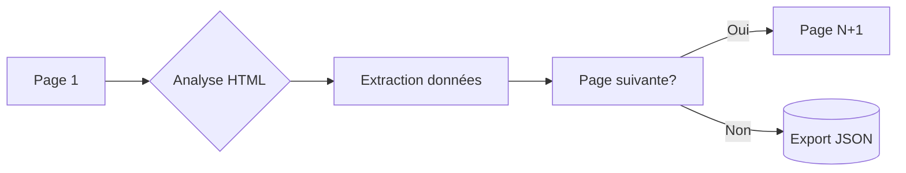

### README.md Professionnel pour ton Portfolio de Scraping

```markdown
# 📚 Web Scraper - Books to Scrape  
 


> Scraper automatisé pour extraire les données de livres du site "Books to Scrape" avec gestion de pagination et export JSON

## 🚀 Fonctionnalités  
- Scraping multi-pages automatique (50+ pages)
- Extraction des titres, prix, notes et disponibilité
- Gestion robuste des erreurs et des timeout
- Export des données structurées en JSON
- Respect des bonnes pratiques de scraping (délais, user-agents)

## 📸 Résultat d'Extraction
```json
[
    {
        "title": "A Light in the Attic",
        "price": "£51.77",
        "rating": "Three stars",
        "availability": "In stock"
    },
    {
        "title": "Tipping the Velvet",
        "price": "£53.74",
        "rating": "One stars",
        "availability": "In stock"
    }
]
```

## 🔧 Installation  
1. Clonez le dépôt :
```bash
git clone https://github.com/tonuser/web-scraping-portfolio.git
cd web-scraping-portfolio
```

2. Créez un environnement virtuel :
```bash
python -m venv .venv
source .venv/bin/activate  # Linux/Mac
.\.venv\Scripts\activate   # Windows
```

3. Installez les dépendances :
```bash
pip install -r requirements.txt
```

## 💻 Utilisation  
Exécutez le scraper principal :
```bash
python src/books_scraper.py
```

Les données seront sauvegardées dans :
- `books.json` (fichier complet)
- `data/sample_books.json` (échantillon)

## 🌐 Structure des Données
| Champ          | Description                  | Exemple              |
|----------------|------------------------------|----------------------|
| `title`        | Titre complet du livre       | "A Light in the Attic" |
| `price`        | Prix en GBP                  | "£51.77"            |
| `rating`       | Note en étoiles (One à Five) | "Three stars"       |
| `availability` | Statut de stock              | "In stock"          |

## 📊 Workflow de Scraping


## 🧠 Apprentissages Techniques
- Navigation paginée avec BeautifulSoup
- Sélecteurs CSS avancés (`select_one`, `find_all`)
- Gestion des erreurs HTTP (404, timeout)
- Transformation des données structurées
- Éthique du web scraping (robots.txt, taux de requêtes)

## 🤝 Contributions  
Les contributions sont les bienvenues ! Pour proposer une amélioration :
1. Forkez le dépôt
2. Créez une branche (`git checkout -b feat/nouvelle-fonctionnalite`)
3. Committez vos changements (`git commit -m 'feat: ajout ...'`)
4. Pushez vers la branche (`git push origin feat/nouvelle-fonctionnalite`)
5. Ouvrez une Pull Request

---

**Projet éducatif** - Ce scraper est destiné à l'apprentissage des techniques de web scraping  
⚠️ Respectez toujours les conditions d'utilisation des sites scrapés


## 🌐 Données Complètes
[https://books.toscrape.com/]


```